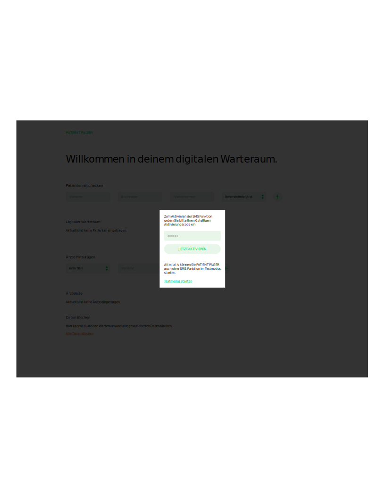
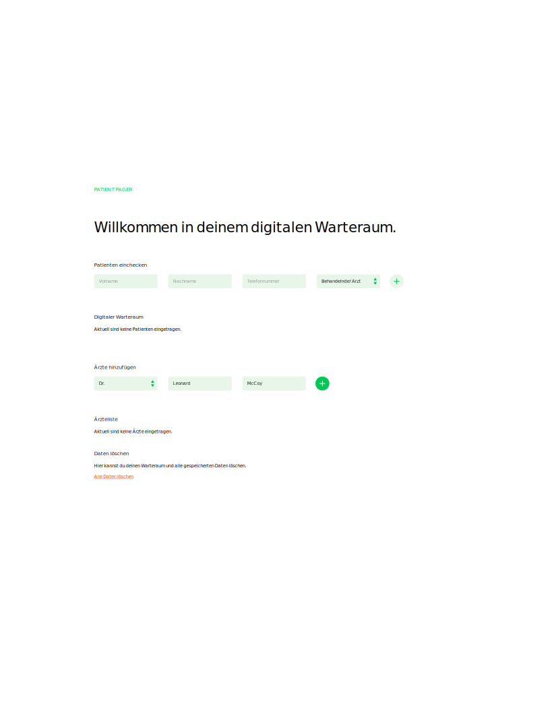
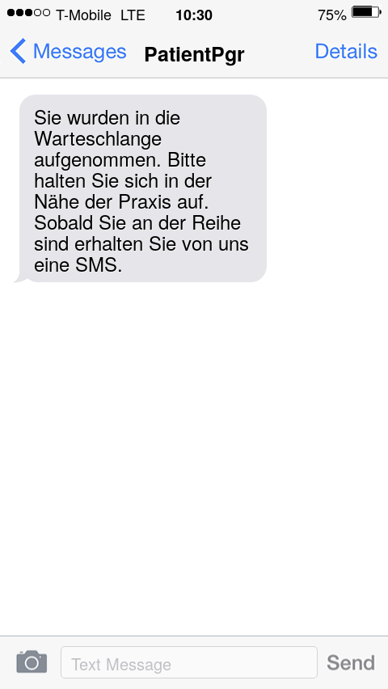
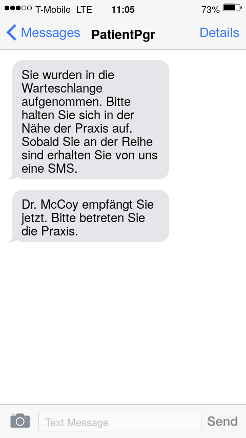

# Patient Pager - Anleitung für Praxispersonal

PatientPager ist ein Software-Tool zum einfachen digitalen Patientenaufruf per SMS.

## Warum PatientPager?

Das Warten vor einem Arzttermin ist ein lästiges aber unausweichliches Problem,
das jedem Patient, Praxismitarbeiter und Arzt wohlbekannt ist. Selbst die
sorgfältigste Planung und größte organisatorische Selbstdisziplin seitens des
Praxisteams kann beispielsweise einer spontanen Anhäufung von Notfällen und
den daraus resultierenden unliebsamen Wartezeiten nur wenig entgegensetzen. 
In der aktuellen Covid-19-Situation ist natürlich das Auftreten eines solchen
oder ähnlicher unvorteilhafter Szenarien häufiger und gleichzeitig besonders
riskant. Denn auch den vorbildlichsten Patienten wird es in überfüllten
Wartezimmern schwer fallen, den allgemein empfohlenen Mindestabstand zu Ihren
Mit-Patienten einzuhalten.

Mit PatientPager kann das Wartezimmer ganz einfach auf die unmittelbare Umgebung
der Praxis ausgedehnt werden, indem geeignete ausgewählte oder freiwillige Patienten
durch eine SMS über Ihr privates Handy aufgerufen werden können. Diesen Patienten
kann damit ermöglicht werden, außerhalb der Praxis zu warten, beispielsweise mit
dem nötigen Sicherheitsabstand im Hausflur oder ein Paar Meter außerhalb der
Praxis auf der nächsten Parkbank.

Das PatientPager-System ist so einfach wie möglich gehalten, und sollte 
größtenteils selbsterklärend sein.
Die folgende Schritt-für-Schritt Anleitung dient dazu, Sie bei der Benutung von
PatientPager zusätzlich zu unterstützen und erkärt an einem Beispiel den Ablauf
der Erstbenutzung von PatientPager und den digitalen Patientenaufruf.

## 1. Erstellen eines Warteraums
Beim erstmaligen Aufruf von [PatientPager](https://www.patient-pager.com)
wird ein Digitaler Warteraum für Ihre Praxis erstellt.

1. Beim Erstaufruf wird Ihnen der Willkommensbildschirm von
   [PatientPager](https://www.patientpager.com) angezeigt. Um Ihren 
   persönlichen digitalen Warteraum zu erstellen, klicken sie dort einfach
   auf den grünen Knopf "Warteraum erstellen".  
     

2. Freischalten der SMS-Funktion (oder Testbetrieb)  
   Um Missbrauch der SMS-Funktion zu verhindern ist es momentan erforderlich,
   jeden neuen Warteraum durch Eingabe eines Aktivierungs-Passworts 
   freizuschalten.   
   Nach Erstellen des Warteraums erscheint deshalb der Aktivierungsbildschirm,
   in dem Sie im Feld "xxxxxx" Ihr persönliches Aktivierungs-Passwort eingeben, und 
   anschließend durch Klicken auf "Jetzt aktivieren" die SMS-Funktion freischalten
   können.  
   

Das war's. Mit diesen einfachen Schritten haben Sie Ihren persönlichen Digitalen
Warteraum erstellt, und Sie haben den Hauptbildschirm von PatientPager vor sich.  
    

*Hinweise zur Freischaltung:* Das 
   Freischalt-Passwort sollten Sie entweder bereits von uns persönlich
   erhalten haben, oder Sie können es ganz einfach durch eine kurze E-Mail an
   [support@patient-pager.com](mailto:support@patient-pager.com)
   anfordern. Falls Sie PatientPager ohne aktive SMS-Funktion testen wollen, 
   können Sie im Freischalt-Bildschirm durch Klicken auf "Testmodus starten" 
   ebenfalls zu Patient-Pager gelangen, um sich mit dessen Bedienung und
   Funktionalität vertraut zu machen.

## 2. Eintragen eines behandelnden Arztes
Nach dem erstmaligen Erstellen des Warteraums sollten Sie mindestens
einen behandelnden Arzt oder Therapeut aus Ihrer Praxis in PatientPager
anlegen.

1. Um einen Arzt einzutragen, geben Sie dessen Namen und Titel in den 
Eingabefeldern unter "Ärzte hinzufügen" ein.  
Beispiel: Um einen Dr. Leonard McCoy anzulegen, wählen sie im Titelfeld "Dr.",
geben Vornamen und Namen des Arztes ein:  
   

2. Wenn der Name korrekt eingetragen ist, wird der
Arzt durch Klicken auf den runden "+"-Knopf zur Ärzteliste hinzugefügt
und erscheint dort als neuer Eintrag.  
     
   *Tipp:* 
   Sollten Sie sich vertippt haben, ist das kein Problem. Sie können
   den Arzt jederzeit durch Klicken auf das "x"-Symbol, welches sich
   neben dem entsprechenden Namen in der Ärzteliste befindet, löschen
   und anschließend mit den korrekten Daten neu anlegen.
      
## 3. Anlegen und Aufrufen von Patienten
Wenn ein Patient wünscht, über PatientPager aufgerufen zu werden,
fragen Sie Ihn nach seiner Handynummer und legen Sie Ihn wie folgt in
PatientPager an:

1. Eingabe der Patientendaten:
   Unter "Patienten einchecken" tragen Sie in den ersten beiden Feldern
   ("Vorname", "Nachname") den Namen des Patienten ein. 
   Die Handynummer des Patienten muss systembedingt im Internationalen
   Format mit der deutschen Vorwahl "+49" in das dritte Feld eingetragen 
   werden.  
   Beispiel: Um den Patienten "James T. Kirk" mit der Hanynummer
   0160-11-22-33-44 anzulegen, geben Sie im Feld "Telefonnummer"
   die Nummer im Format "+4916011223344" an.  
   Zuletzt wird im Feld "Behandlender Arzt" ein bereits 
   angelegter Arzt ausgewählt. In unserem Beispiel ist das "Dr. McCoy".  
   

2. Bevor Sie den Patienten durch Klicken auf den "+"-Knopf unter 
   "Patienten einchecken" anlegen, prüfen Sie am Besten noch einmal,
   ob dessen Handynummer korrekt eingegeben wurde.  
   Sobald Sie den Patienten durch Klicken auf den "+"-Knopf unter 
   "Patienten einchecken" anlegen, lösen Sie zwei Funktionen von PatientPager
   aus.  
   Erstens erscheint der neu angelegte Patient in Ihrem digitalen
   Warteraum.  
      
   Zweitens wird dem neu angelegten Patienten eine Informations-SMS 
   geschickt, dass er sich im digitalen Warteraum Ihrer Praxis befindet.  
   *Empfehlung:* Warten Sie zusammen mit dem Patienten den Erhalt der
   Informations-SMS ab. Damit können Sie noch einmal zusätzlich überprüfen, dass
   der SMS-Kontakt mit dem gerade angelegten Patienten tatsächlich
   korrekt hergestellt werden kann.  
   Unser Beispielpatient "James T. Kirk" hat für seinen Termin bei "Dr. McCoy"
   die folgende Informations-SMS erhalten:  
     

3. Zum Aufruf eines eingetragenen Patienten aus Ihrem Warteraum
   betätigen Sie den Knopf "SMS SCHICKEN" neben dem entsprechenden Patienten
   aus Ihrem digitalen Warteraum. Der Patient erhält dann innerhalb kurzer
   Zeit die Aufruf-SMS, die ihn zum Wahrnehmen seines Termins auffordert.
   Unser Beispielpatient "James T. Kirk" hat für seinen Termin bei "Dr. McCoy"
   die folgende Aufruf-SMS erhalten:  
        
   *Hinweis:* Idealerweise senden Sie die Aufruf-SMS mit ein paar Minuten 
    Vorlaufzeit, denn reale Patienten können sich, im Gegensatz zu unserem
    Beispielpatienten, in der Regel nicht so einfach vor die Tür des
    Behandlungszimmers zurückbeamen lassen.  

4. Sie können bei Bedarf einen Patienten auch aus dem digitalen Warteraum
   löschen, ohne eine Aufruf-SMS zu versenden. Hierfür klicken sie auf das 
   Löschen-Symbol "x" im entsprechenden Patienteneintrag.

## Datenschutz und Löschen Ihrer Daten

Bei Patient-Pager werden Ihre Daten, insbesondere Ärzte und Patienten-Namen,
vorrangig auf Ihren eigenen Geräten gespeichert, d.h. in Ihrem Web-Browser.
Auf die Servern von Patient-Pager wird nur ein spezielles Passwort hinterlegt,
welches beim Erstellen Ihres digitalen Warteraum generiert wird vom Server
zur Identifizierung Ihr freigeschalteten Warteraums und für den SMS-Versand
benötigt wird.

Bei Anlegen eines Patienten wird eine anonymisierte Patienten-Kennung generiert,
die zusammen mit dessen Handynummer zum Zweck des SMS-Versands auf dem Server
hinterlegt wird. Weitere Informationen werden nicht hinterlegt und sämtliche
Patienten-Informationen werden nach 24 Stunden gelöscht. SMS-Inhalte werden in
Ihren Geräte mithilfe der dort lokal hinterlegten Informationen generiert.
Insbesondere werden SMS-Inhalte von unserem Server nur an einen SMS-Dienst
weitergegeben, aber nicht gespeichert.

Sie können alle von PatientPager lokal in Ihren Geräten gespeicherten
Informationen jederzeit vollständig löschen. Die Löschung wird durch Klicken auf
"Alle Daten löschen" nach einem anschließenden Bestätigungsdialog ausgelöst. Der
Knopf "Alle Daten löschen" befindet sich ganz unten auf dem Hauptbildschirm von
PatientPager. Natürlich können Sie nach Löschen Ihrer Daten wieder einen neuen
Warteraum erstellen. Zuvor eingegebene Ärzte- und Patientendaten können jedoch
nicht wiederhergestellt werden und müssen bei Bedarf neu eingegeben werden.

## Problembehebung
Sollten bei der Benutzung auf Problem stoßen, können Sie diese möglicherweise
durch Anlegen eines neuen Warteraums beheben. Hierfür können Sie den Knopf
"Alle Daten löschen" auf dem Hauptbildschirm von PatientPager benutzen. Dieser
führt sie nach einer Bestätigung zurück zum Willkommensbildschirm führt, wo
sie einen neuen Warteraum erstellen können. Falls das Neuerstellen des
Warteraums nicht hilft, oder sie andere Fragen haben, wenden Sie sich
bitte per Mail an [support@patient-pager.com](mailto:support@patient-pager.com).
